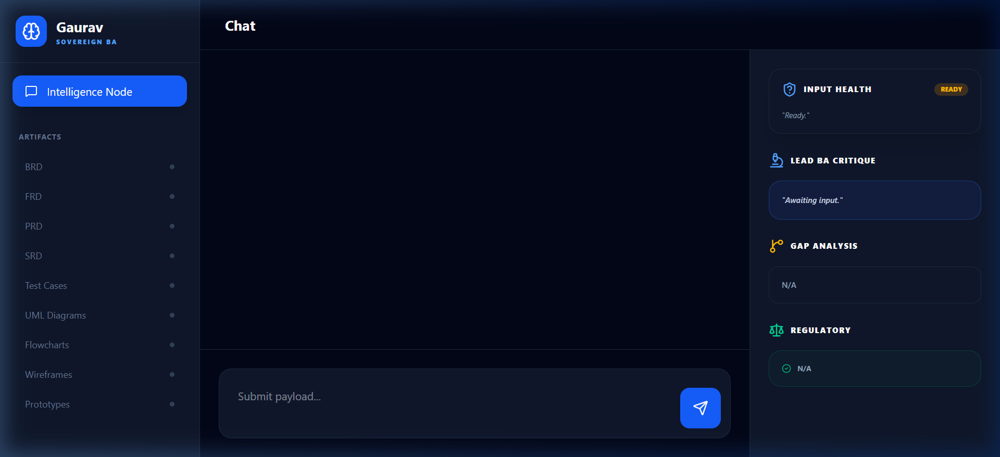
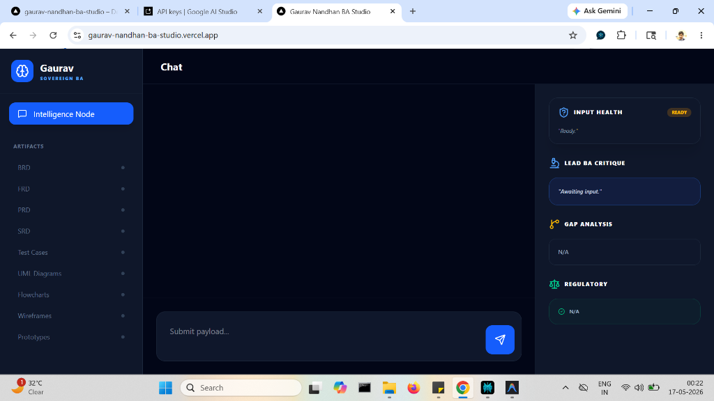
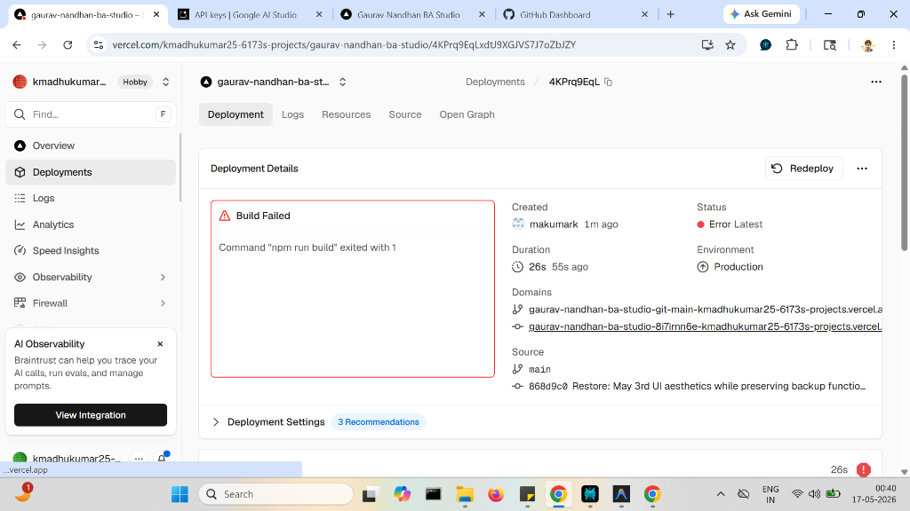

# Gaurav Nandhan BA Studio
## The Ultimate User Manual

**Welcome to the future of software building!**

Hi there! Imagine you have a magical, super-smart assistant who listens to your business ideas and instantly writes down all the rules, draws the architecture diagrams, and even builds a small clickable model for you. That is exactly what this tool does!

This manual will walk you step-by-step through how to use the Gaurav Nandhan BA Studio.

---

## 1. The Main Dashboard (Your Command Center)

When you first open the app, you will see a screen that looks like this:

This is your Command Center. 
- On the **left side**, you have your Document Tabs (BRD, FRD, UML Diagrams, etc.).
- On the **right side**, you have the Intelligence Panel which scores how good your idea is.
- At the **bottom**, you have the Magic Chat Box.

---

## 2. Feature 1: The Magic Chat Box (MOM Analysis)

The very first thing you must do is tell the AI what you want to build.

**How to do it:**
1. Look at the bottom of the screen.
2. Type in your "Meeting Minutes" (MOM) or just a simple sentence like: *"I want to build an app for doctors to book appointments."*
3. Click the **Analyze** button.

### What happens next?
The AI will read your idea. If your idea is confusing, the AI will stop you and act like a smart gatekeeper. It might say, *"Wait, are these doctors working in a hospital or private clinics?"* 
You just reply to the AI until it says your idea is **READY!**

---

## 3. Feature 2: Document Generation Tabs

Once the AI says your idea is ready, you can start clicking the buttons on the left side of the screen.

**Here are the different documents you can generate:**
- **BRD (Business Requirements Document):** Tells you WHY you are building the product and how much money it will save.
- **FRD (Functional Requirements Document):** Tells the programmers exactly WHAT the buttons and screens need to do.
- **Test Cases:** Tells the testers exactly how to check if the app is broken.

**How to use it:** 
Just click on any tab (like **"BRD"**), and watch the AI type out a professional, 10-page document for you instantly!

---

## 4. Feature 3: Visual Diagrams & Prototypes

Sometimes reading text is boring. People like pictures and clickable things!

- **UML & Flowcharts:** If you click on "UML Diagrams", the AI will draw a technical map showing how your idea works. It shows how a user clicks a button and where the data goes.
- **Wireframes:** The AI will draw a gray-scale sketch of what your app will look like.
- **Prototypes:** The AI will actually write real computer code (HTML/Tailwind) to build a mini, colorful version of your app that you can click on right inside the studio!

---

## 5. Feature 4: The "Regenerate" Button 

What if you generate a document, but then you tell the chat box, *"Wait, I want to add a Payment feature!"*?

Don't worry! The system remembers everything. 
Look at the top of your document screen for a button with a lightning bolt that says **"Regenerate with v2 Updates"**. 

If you click it, the AI will read your new rules and completely rewrite your document to include the Payment feature. It's like having a magical eraser!

---

## 6. Feature 5: Exporting & Saving (Sharing with friends)

You can't just leave your hard work stuck inside the app! You need to share it with your boss or your developers.

Look at the **Top Bar** of the screen:
1. **PDF Export:** Click this button to download all your documents as a shiny PDF file.
2. **Copy:** Click this to copy the text so you can paste it into an email.
3. **Jira Sync:** Click this button, and the AI will magically send all the tasks and rules straight to your developer's Jira board!
4. **Save Session:** Don't forget to click this before you close the window so you don't lose your work!

---

## Summary
You are now an expert at using the Gaurav Nandhan BA Studio! Just remember the 3 simple steps:
1. **Chat** your idea.
2. **Click** the tabs to generate documents.
3. **Export** your work.

Happy Building!
